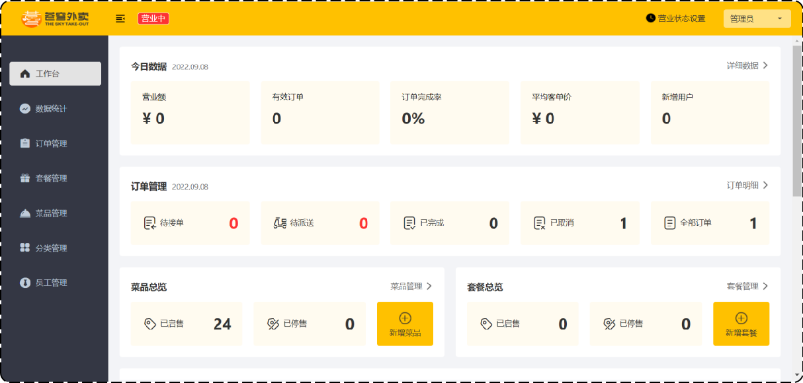

# 项目展示

概述：本项目（苍穹外卖）是专门为餐饮企业（餐厅、饭店）定制的一款软件产品，包括 系统管理后台 和 小程序端应用 两部分。其中系统管理后台主要提供给餐饮企业内部员工使用，可以对餐厅的分类、菜品、套餐、订单、员工等进行管理维护，对餐厅的各类数据进行统计，同时也可进行来单语音播报功能。小程序端主要提供给消费者使用，可以在线浏览菜品、添加购物车、下单、支付、催单等。

管理端展示：



客户端展示：


# 使用

```
启动项目
	环境启动：比如mysql，redis等
	前端启动：因为前端采用了nginx，文件都在nginx中配置好了，直接运行nginx.exe即可。开关闭：start nginx/nginx -s stop
	后端启动：记得使用maven先进行编译一下，再启动主模块中的启动类。
	启动nginx和数据库后，打开localhost:80或localhost
	swagger的接口文档：http://localhost:8080/doc.html
```

