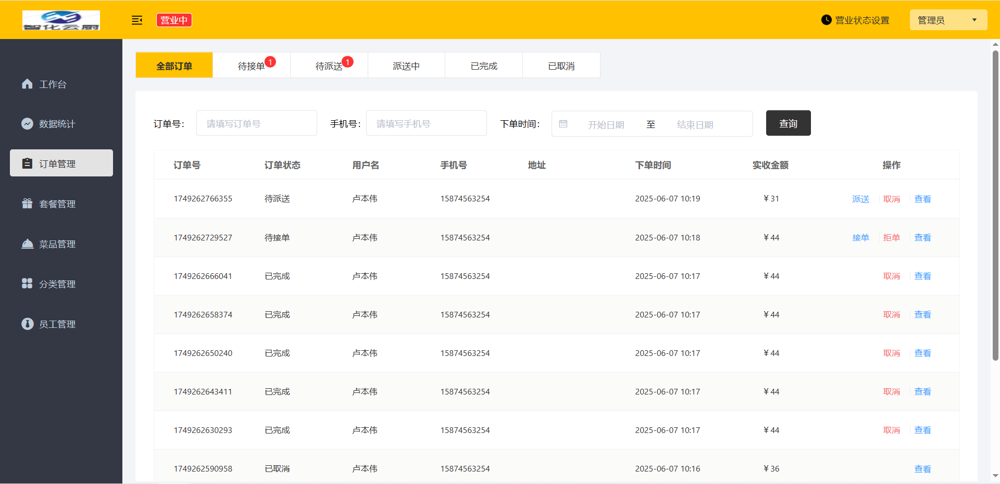

# 项目展示

概述：本项目是专门为校园的餐厅定制的一款软件产品，包括 系统管理后台、小程序端应用和骑手端应用(开发中...)三部分。

系统管理后台主要提供给餐饮企业内部员工使用，可以对餐厅的分类、菜品、套餐、订单、员工等进行管理维护，对餐厅的各类数据进行统计，同时也可进行来单语音播报功能。

小程序端主要提供给消费者使用，可以在线浏览菜品、添加购物车、下单、支付、催单等。

骑手端主要是提供给骑手，用于接单，送餐等。

客户端展示：


管理端

工作台展示：


数据统计展示：


订单管理展示：



套餐管理展示：


员工管理展示：


# 使用

```
启动项目
	环境启动：启动mysql，redis等
	前端启动：启动nginx。
	后端启动：启动server模块中的启动类。
	启动nginx和数据库后，打开localhost:80或localhost
	swagger的接口文档：http://localhost:8080/doc.html
```

